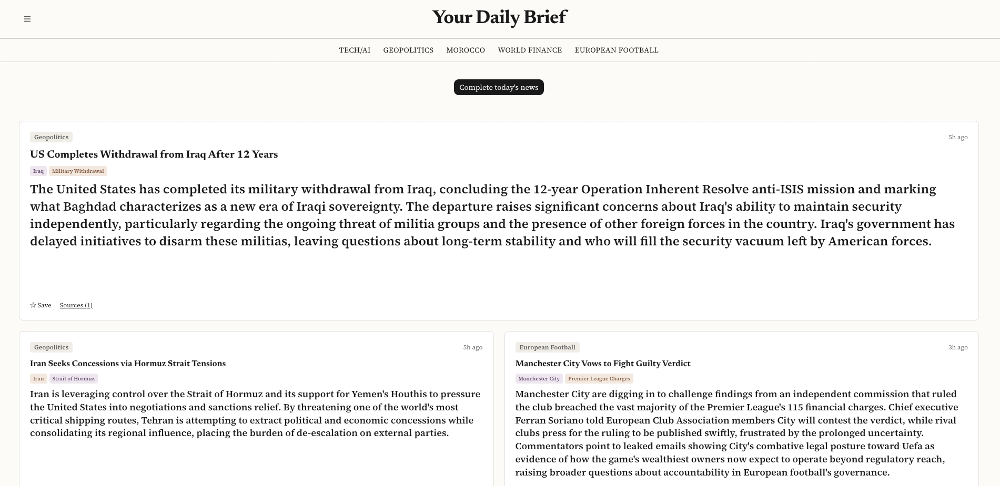
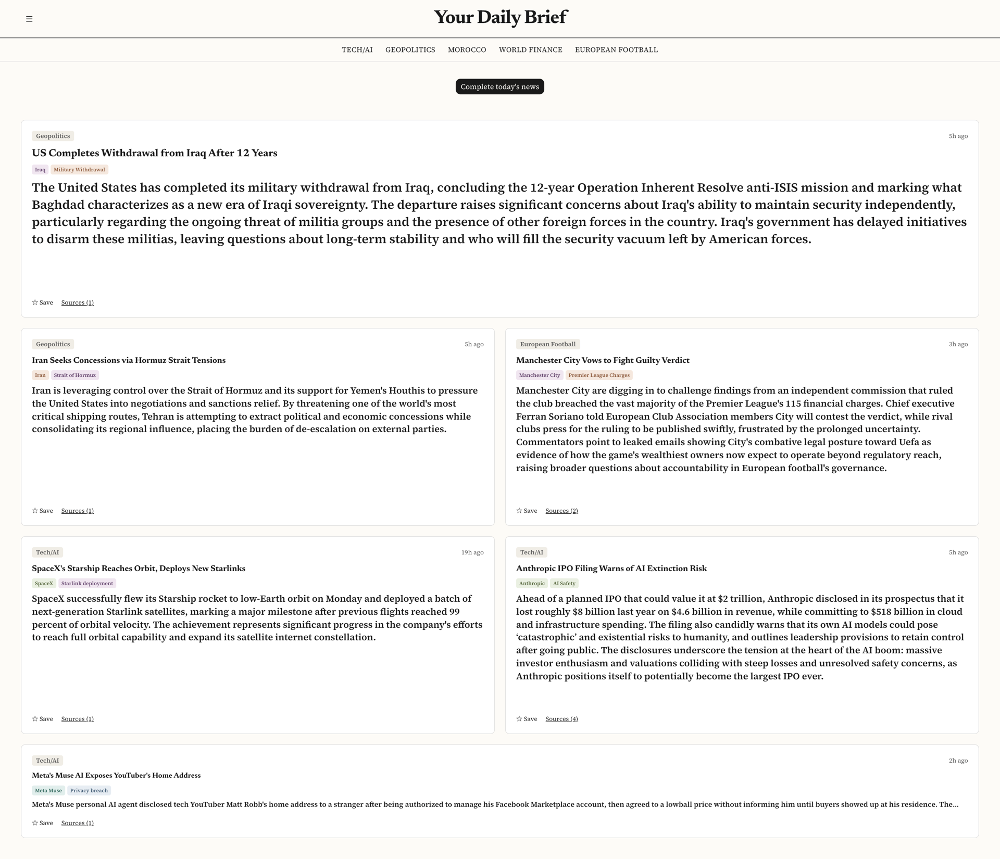

# Personalized News Aggregator

A daily news briefing that reads the outlets you trust and hands back one card per story.

**Live at [news.h72labs.com](https://news.h72labs.com)**, invite-only while it's in early testing. I built it solo as one of two flagship products at H72 Labs, my software studio (Hachad Solutions LLC).

<b>See the full front page</b> (click to expand)

## What it does

You pick the topics you follow and the outlets you trust. There are 13 topics, among them Moroccan politics, US politics, geopolitics, AI, world finance and European football, and 48 outlets, including the BBC, Le Monde, the Financial Times, Hespress, Al Jazeera and ESPN. Then you press one button: "give me today's news."

About a minute later you get a feed where each card is one specific story, not a topic bucket. When several outlets covered the same event, the card is written from all of them. Each card has a short summary up front, a longer report if you open it, and links to the original articles. The biggest stories across all your topics go on a front page, and the rest sit under their own topic. Past days stay in a calendar archive, and any card can be bookmarked.

## How it works

1. **Collect.** Pull the latest articles from the reader's chosen feeds. A first run on every topic brings in about 1,100.
2. **Group.** A small AI model running on the server spots articles about the same event and merges them into one story. It costs nothing per run, because no paid API is called.
3. **Judge.** Claude Haiku, Anthropic's fast low-cost model, scores each story for how much it matters within its topic, and most get dropped here.
4. **Write.** Claude Sonnet, the stronger and pricier model, writes the stories that several outlets covered. Single-source stories go to Haiku, since there's nothing to reconcile.
5. **Rank.** One final call looks at everything that survived and picks the front page across all topics.

## Engineering highlights

- **Running cost cut by 80%.** I added cost tracking to every model call. The real figure was \$1.66 per daily briefing, about ten times what the docs said, and most of the money went to judging stories rather than writing them. Batching, matching each task to the cheapest model that does it well, and capping cards per topic brought it to \$0.34. A new user following all 13 topics, the most expensive setup possible, measured \$0.49 in production.
- **Spending can't run away.** Before any paid call, a run reserves its worst-case cost in the database, then settles to the real amount. Daily limits per user and across all users live in Postgres, so a crashed run still counts and no user can edit their own spend. When one account fired 20 simultaneous attempts to start a run, exactly one got through.
- **Invite-only at the source.** Sign-up passes through a database check on a single-use invite, stored only as a hash. Calling the sign-in service directly doesn't get around it, because the check runs inside it.
- **A security review before the first invite.** Run against the live site, it found and fixed a critical vulnerability in the web framework version the site ran on, a cross-site scripting path through links taken from news feeds, missing browser security headers, and a password change that didn't ask for the current password.
- **Fits on a free serverless tier.** A full 13-topic briefing takes 80 of the platform's 120 allowed seconds and 917 MB of its 2 GB memory. The grouping model ships inside the deployment, at 79 MB against a 250 MB limit.
- **Tested before it merges.** 1,527 automated tests. Every feature also goes through two independent AI agents, one writing and running tests and one reviewing the code, before it's merged.

## Built with

Next.js 16 and React (TypeScript, Tailwind CSS) · Supabase (PostgreSQL with row-level security, authentication) · Claude API (Haiku 4.5, Sonnet 5) · transformers.js with all-MiniLM-L6-v2 for grouping · Resend for email · Vercel · Vitest

## Current limits

- Invite-only, with no public sign-up yet.
- Topics and outlets come from curated lists; typing your own isn't supported yet.
- Coverage depends on RSS, so an outlet without a feed can't be followed.
- Briefings are written in English, including stories from French, Spanish and German outlets.

## Running it locally

You'll need Node.js (current LTS), a Supabase project, and an Anthropic API key.

1. `npm install`
2. Run `supabase/schema.sql` in the Supabase SQL editor, then enable `public.hook_require_invite` as the *Before User Created* auth hook.
3. Copy `.env.example` to `.env.local` and fill in `ANTHROPIC_API_KEY`, `SUPABASE_URL`, `SUPABASE_PUBLISHABLE_KEY` and `RECOVERY_MARKER_SECRET` (any long random string).
4. `npm run dev`, then open <http://localhost:3000>.

Sign-up needs an invite. Put `SUPABASE_URL`, `SUPABASE_SECRET_KEY` and `INVITE_BASE_URL=http://localhost:3000` in a separate `.env.admin`, then run `npm run invite -- "<label>" <email>`. Tests run with `npm test`.

## License

Copyright © 2026 Hachad Solutions LLC. All rights reserved. The code is published so it can be read; it is not licensed for reuse. See [LICENSE](LICENSE).
